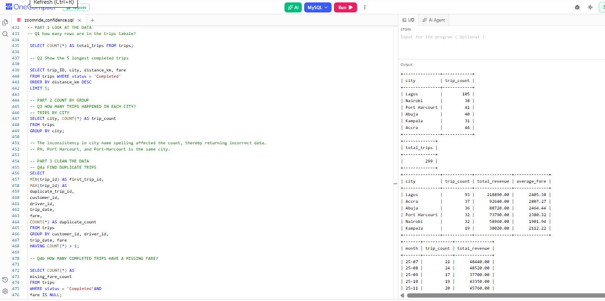

# ZOOMRIDE_SQL_PROJECT

## PROJECT OVERVIEW
ZoomRide is a company that sells rides in cars and bikes, like Uber or Bolt.

It works in 6 cities: Lagos, Abuja, Port Harcourt, Nairobi, Accra and Kampala.

I looked at the data, cleaned it, and find the answers with SQL.
 
---
## BUSINESS QUESTIONS ANSWERED
The manager wants answers to these questions: 
- Which city earns the most money?
- Which month do people ride the most?
- Which type of vehicle earns the most money?
- 5 longest completed trips.
- Find the duplicate trips.
- How many trips happened in each city?
- How many Completed trips have a missing fare?
-  Revenue by City.
-  Revenue by Month
-  Revenue by Vehicle
---
## TOOLS USED
I used OneCompiler as an editor for the SQL.

---
## KEY INSIGHT
- There were total of 300 initial trips.
- One ride had a duplicate. I deleted the duplicate, leaving us with the total trip of 299.
-  9 rides recorded their fares missing.
-  Lagos generated the highest revenue-#218,890, followed by Accra-#92,640, Abuja-#88,720, Port Harcourt-#73,790, etc.
-  The highest number of trips (121) were done using the Economy vehicles.
-  Customer Chioma Nwosu recorded the highest number of trips. She spent #38,950, and her city is Lagos.
-  4 customers never booked a ride. Two are from Nairobi, one from Lagos, and the other from Kampala.
-  December 2025 recorded the highest number of trips and revenue (31 trips, #66,980). 
## PROJECT PREVIEW

---

## FILES IN THIS REPOSITORY

- [Screenshot](Screenshot_ZOOMRIDE_2026.png)
- [Dataset](zoomride_setup.txt)
- [Massage_TO_Manager](ZOOMRide_SQLMessageTo_Manager.pdf)
- README.md
---

## CONCLUSION
Overall, the analysis shows that Lagos generated the highest revenue, while Economy vehicles recorded the highest number of trips.
However, the missing fares and duplicate ride highlight data-quality issues that should be addressed. 

I recommend reviewing the 9 rides with missing fares, identifying the cause, and implementing validation checks to ensure every completed trip has a recorded fare before future reports are generated.
